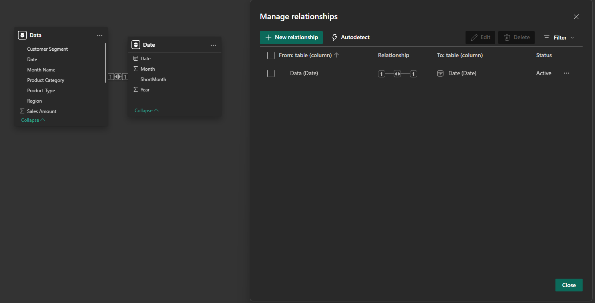
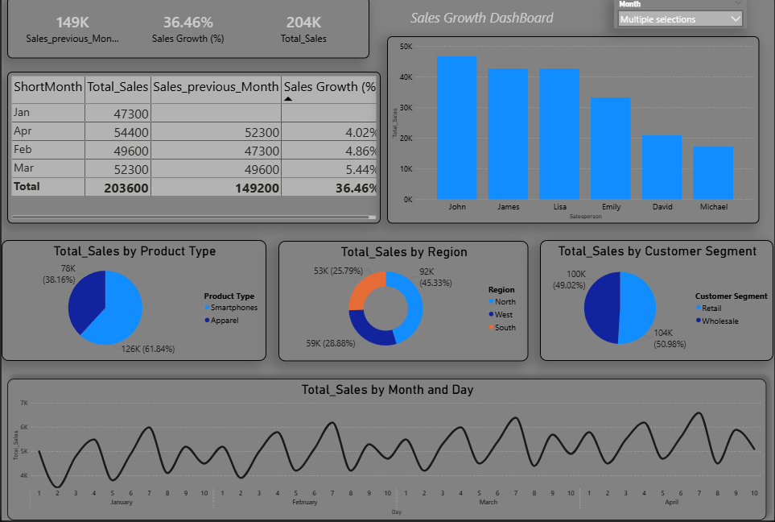

# 📈 Sales Monthly Growth Dashboard

## 📌 Overview
This project focuses on analyzing **monthly sales performance** to identify growth trends, measure business performance, and support data-driven decision-making using Power BI.

The project demonstrates how raw sales data can be transformed into meaningful insights through **data modeling, DAX calculations, and interactive visualizations**.

---

## 🧱 Data Modeling

- Created a simple data model connecting:
  - Sales Data table  
  - Date dimension table  
- Built relationship using Date field to enable time-based analysis  
- Designed model to support accurate aggregation and filtering  

---

## 🧹 Data Preparation
- Cleaned and transformed data using **Power Query**  
- Standardized date formats and created time-related columns:
  - Month  
  - Short Month  
  - Year  
- Ensured data consistency for accurate reporting  

---

## 📊 Dashboard Overview

The dashboard provides a clear view of business performance through multiple perspectives:

---

## 📈 Key Metrics (KPIs)
- Total Sales  
- Sales Previous Month  
- Sales Growth (%)  

---

## 📊 Analysis Features

### 🔹 Monthly Growth Analysis
- Tracks month-over-month sales performance  
- Calculates growth percentage using DAX  
- Identifies increase and decrease patterns  

---

### 🔹 Sales by Salesperson
- Compares performance across different sales representatives  
- Highlights top and low performers  

---

### 🔹 Product Analysis
- Sales distribution by product type  
- Helps identify top-selling categories  

---

### 🔹 Regional Analysis
- Sales performance across regions  
- Provides insights into geographic distribution  

---

### 🔹 Customer Segment Analysis
- Compares sales between Retail and Wholesale customers  
- Highlights contribution of each segment  

---

### 🔹 Time Series Analysis
- Daily and monthly sales trends  
- Helps identify patterns and seasonality  

---

## 📊 Key Insights
- Sales show noticeable variation across months  
- Growth percentage highlights periods of strong and weak performance  
- Some sales representatives outperform others significantly  
- Product categories contribute differently to total sales  
- Regional performance varies across different areas  

---

## 🛠️ Tools Used
- Power BI  
- Power Query  
- DAX  
- Data Modeling  
- Data Visualization  

---

## 🚀 Outcome
This project demonstrates the ability to:
- Build a complete Power BI dashboard  
- Perform time-based analysis (MoM growth)  
- Use DAX to calculate business metrics  
- Deliver clear and interactive business insights  

---

## 📁 File
- `Sales Growth DashBoard.pbix`
